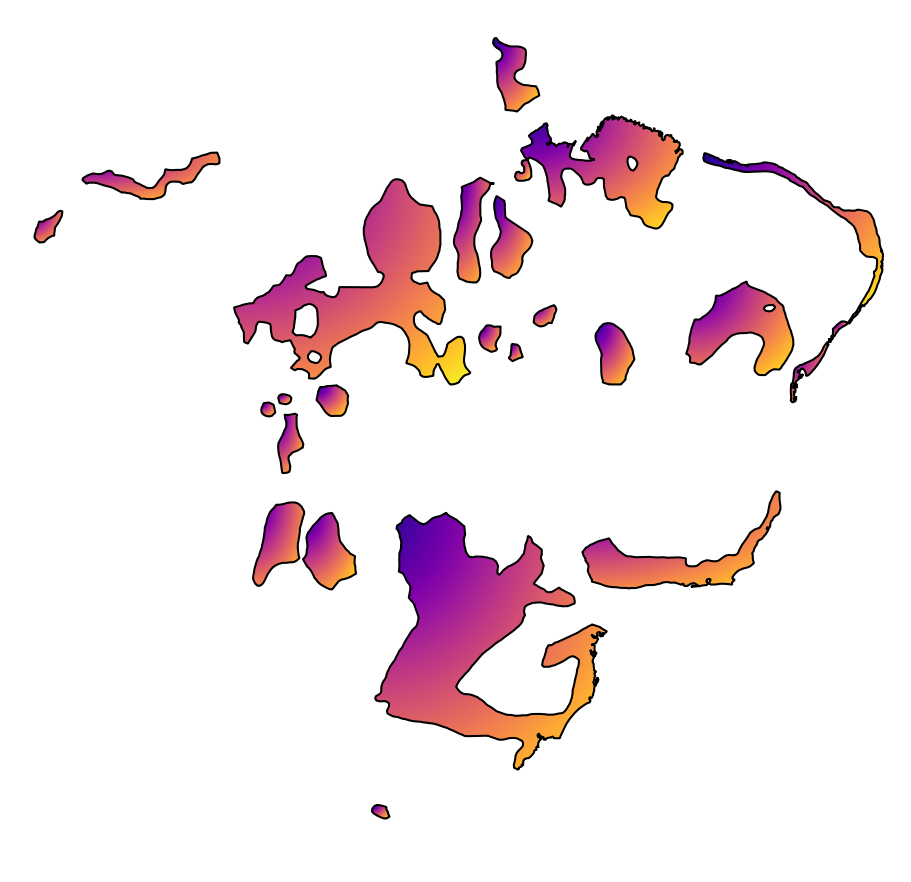

# Summary

UD_Akunstu-TuDeT is a collection of annotated sentences in <a href="http://endangeredlanguages.com/lang/1567"> Akuntsú</a>.
Together with <a href="http://www.endangeredlanguages.com/lang/2981">UD_Munduruku-TuDeT</a> and <a href="https://github.com/UniversalDependencies/UD_Tupinambá-TuDeT">UD_Tupinambá-TuDeT</a>, UD_Akuntsu-TuDeT is part of <a href="https://tular.org">TuLaR</a>. 

 
 
 
 
 

# Introduction

UD_Akuntsu-TuDeT is a collection of annotated texts in Akuntsú. Together with [UD_Tupinamba-TuDeT](https://github.com/UniversalDependencies/UD_Tupinamba-TuDeT) and UD_Munduruku-TuDeT, UD_Akuntsu-TuDeT is part of the [TuLaR](https://tular.org) project.  The sentences are being annotated by Carolina Aragon and Fabrício Ferraz Gerardi. Besides the wors cited in the References Section, all the annotated sentences stem from Carolina's field work. 

# Acknowledgments

The development of the treebank is supported by the European Research Council (ERC) under the European Union’s Horizon 2020 research and innovation programme (Grant agreement No. [834050](https://uni-tuebingen.de/fakultaeten/philosophische-fakultaet/fachbereiche/neuphilologie/seminar-fuer-sprachwissenschaft/arbeitsbereiche/allg-sprachwissenschaft/projekte/crosslingference/)).

## References
  
* Aragon, Carolina (2018) *Variações estilísticas e sociais no discurso dos falantes Akuntsú*. Revista Polifonia, v. 25, 90-103. 
* Aragon, Carolina (2018) *Posposições e marcadores oblíquos em Akuntsú (Tupí)*. Revista Brasileira de Linguística Antropológica, v. 10, 47-57. 
* Aragon, Carolina (2015) *Considerações sobre os ideofones e seu uso em Akuntsú*. Revista de Letras (Taguatinga), v. 8, 1-13.
* Aragon, Carolina (2014) *A Grammar of Akuntsú, a Tupian language*. PhD dissertation, University of Hawaii, unpublished PhD dissertation. 
* Aragon, Carolina (2008) *Fonologia e aspectos morfológicos e sintáticos da língua Akuntsú*. Master thesis, Universidade de Brasília, unpublished master thesis.

# Changelog

* 2020-11-15 v2.7
  * Initial release in Universal Dependencies.

<pre>
=== Machine-readable metadata (DO NOT REMOVE!) ================================
Data available since: UD v2.7
License: CC BY-SA 4.0
Includes text: yes
Genre: nonfiction news
Lemmas: converted from manual
UPOS: converted from manual
XPOS: manual native
Features: converted from manual
Relations: converted from manual
Contributors: Aragon, Carolina; Gerardi, Fabrício Ferraz
Contributing: elsewhere
Contact: fabricio.gerardi@uni-tuebingen.de
===============================================================================
</pre>
